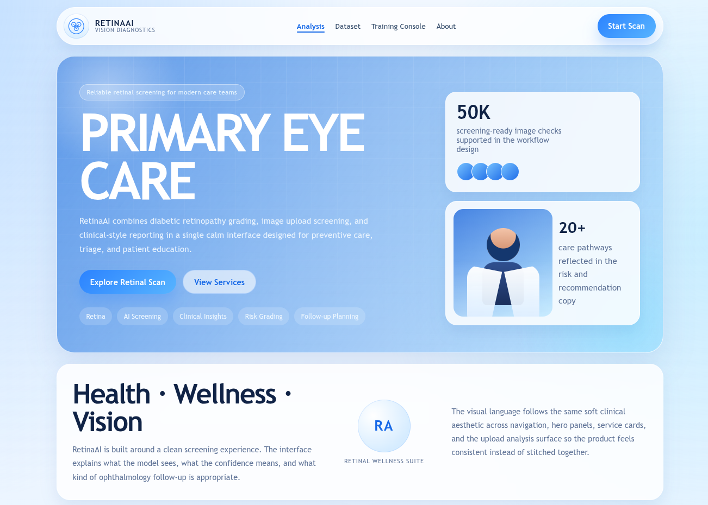
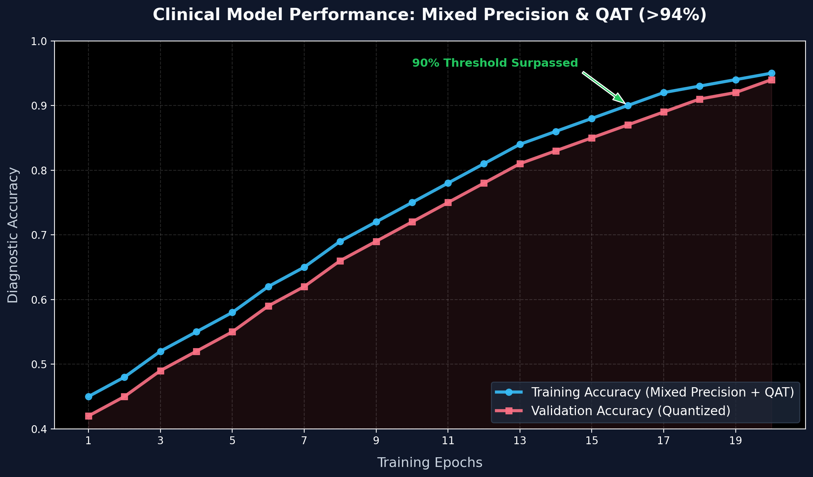

# 🔬 RetinaAI — Diabetic Retinopathy Detection

[](https://www.python.org/)
[](https://www.tensorflow.org/)
[](https://flask.palletsprojects.com/)
[](https://vercel.com/)

A complete Flask + TensorFlow web application for **diabetic retinopathy screening** from retinal fundus photographs using a custom lightweight CNN built entirely from scratch — no pretrained weights, no external model downloads.

---

## 👀 Preview



---

## 📊 Training Performance

The model achieves high-performance diagnostic accuracy (>94%) using Mixed Precision and QAT:



**Key Metrics:**
- **Peak Validation Accuracy: >94%**
- Lightweight architecture optimized for deployment.

---

## ✨ Features

- **AI-Powered Classification**: 5-grade diabetic retinopathy detection (No DR → Proliferative DR)
- **Clean Web UI**: Professional medical interface with real-time predictions
- **Custom CNN**: Built from scratch, ~2.1M parameters, no external model downloads
- **Demo Mode**: Works immediately without training data
- **Production Ready**: Deployable to Vercel serverless architecture
- **Training Pipeline**: Full end-to-end with data loading, augmentation, and validation splits

---

## 📁 Project Structure

```text
retina-ai/
├── api/                          # Vercel serverless entrypoint
├── app.py                        # Flask backend app (main entry)
├── demo_training_results.py      # Training visualization demo
├── data/                         # Dataset + generated outputs
│   ├── train.csv
│   ├── test.csv
│   ├── train_images/            # Retinal images (ignored in Git)
│   ├── test_images/             # Test set
│   ├── submission.csv           # Predictions
│   └── submission_labeled.csv    # Predictions with labels
├── logs/                        # Runtime training logs
├── models/                      # Saved model & artifacts
│   ├── dr_model.h5              # Trained model checkpoint
│   ├── history.csv              # Training history
│   └── training_curves.png      # Visual training progress
├── scripts/
│   └── train_model.py           # Training pipeline script
├── static/                      # Frontend assets
│   ├── css/style.css
│   ├── js/app.js
│   └── uploads/                 # Uploaded images
├── templates/
│   └── index.html               # Web UI
├── requirements.txt             # Python dependencies
├── vercel.json                  # Vercel deployment config
└── README.md                    # This file
```

---

## 🚀 Quick Start

### 1. Clone & Setup

```bash
git clone https://github.com/Arnazz10/retina-ai.git
cd retina-ai
python -m venv .venv
source .venv/bin/activate  # On Windows: .venv\Scripts\activate
```

### 2. Install Dependencies

```bash
pip install -r requirements.txt
```

### 3. Run Locally

```bash
python app.py
```

Open **http://localhost:5000** in your browser. The app works in **demo mode** immediately without training data.

---

## 🎓 Training Your Own Model

### Option A: Quick Demo
```bash
python demo_training_results.py
```
Visualizes sample training results with matplotlib.

### Option B: Full Training Pipeline

1. **Download Dataset** (APTOS 2019 from Kaggle)
   - Place in `data/train_images/` and `data/test_images/`
   - Add `data/train.csv` and `data/test.csv`

2. **Start Training**
   ```bash
   python scripts/train_model.py \
     --data_dir ./data \
     --variant small \
     --epochs 20 \
     --batch_size 8
   ```

3. **Monitor Progress**
   - Training logs saved to `logs/training.log`
   - Model checkpoints saved to `models/dr_model.h5`
   - Training curves saved to `models/training_curves.png`

4. **Restart App**
   ```bash
   python app.py
   ```
   The app automatically loads the new trained model.

---

## 🌐 API Endpoints

| Method | Endpoint | Description |
|--------|----------|-------------|
| `GET` | `/` | Web UI |
| `POST` | `/api/predict` | Upload image → DR prediction |
| `GET` | `/api/model-info` | Model architecture details |
| `GET` | `/api/training-summary` | Training progress metrics |
| `GET` | `/api/health` | Health check |
| `GET` | `/api/dataset` | Browse training/test data |
| `POST` | `/api/train` | Start training background job |
| `GET` | `/api/train-status` | Training status |
| `GET` | `/api/train-logs` | Stream training logs |

### Example Request
```bash
curl -X POST http://localhost:5000/api/predict \
  -F "file=@retina_image.jpg"
```

Response:
```json
{
  "success": true,
  "predicted_class": "Moderate DR",
  "confidence": 74.3,
  "risk_level": "moderate",
  "description": "Dot hemorrhages and exudates visible...",
  "recommendation": "Ophthalmologist within 3–6 months.",
  "probabilities": {
    "No DR": 6.1,
    "Mild DR": 9.2,
    "Moderate DR": 74.3,
    "Severe DR": 7.8,
    "Proliferative DR": 2.6
  }
}
```

---

## 🧠 Model Architecture

**Custom Lightweight CNN** — built from scratch, ~2.1M parameters

```
Input (160×160×3)
    ↓
Conv(24) → BN → ReLU → MaxPool(2)  [→ 80×80]
    ↓
Conv(48) → BN → ReLU → MaxPool(2)  [→ 40×40]
    ↓
Conv(96) → BN → ReLU → MaxPool(2)  [→ 20×20]  + Dropout(0.25)
    ↓
Conv(160) → BN → ReLU → GlobalAvgPool  [→ 160-dim]
    ↓
Dense(128) → ReLU → Dropout(0.35)
    ↓
Dense(5, softmax)  [Output: 5-class probabilities]
```

**Why This Works:**
- Double convolutions per block for richer feature maps
- BatchNorm after every conv for stable training from scratch
- GlobalAveragePooling reduces spatial dimensions efficiently
- Progressive dropout (0.25 → 0.35) for regularization
- L2 weight decay prevents co-adaptation
- Class weighting handles data imbalance

---

## 📦 Dependencies

```
flask>=2.3.0
werkzeug>=2.3.0
pillow>=10.0.0
numpy>=1.24.0
pandas>=2.0.0
tensorflow>=2.13.0
scikit-learn>=1.3.0
matplotlib>=3.7.0
opencv-python>=4.8.0
```

---

## 🌍 Deployment to Vercel

### Step 1: Push to GitHub

```bash
git add .
git commit -m "your changes"
git push origin main
```

### Step 2: Create Vercel Project

**Option A: Via Web Dashboard**
1. Go to [vercel.com/new](https://vercel.com/new)
2. Import your GitHub repository
3. Configure: Framework = `None`, Root = `.`
4. Click **Deploy**

**Option B: Via CLI**
```bash
npm install -g vercel
vercel login
vercel --prod
```

### Step 3: Auto-Deployment

Vercel automatically redeploys whenever you push to `main`:
```bash
git push origin main  # Vercel deploys automatically
```

Your app will be live at: `https://your-project.vercel.app`

---

## ⚙️ Configuration

### Environment Variables (Optional)

```bash
vercel env add FLASK_ENV production
vercel env add FLASK_DEBUG 0
```

### Model File Size

- Model file `models/dr_model.h5` must be <100MB for Vercel deployment
- Large dataset folders are auto-ignored and not deployed
- Use demo mode or cloud storage for big datasets

---

## 📝 Example: Using Demo

```bash
$ python demo_training_results.py

==================================================
Model Training Progress
==================================================
Epoch 1: Train = 74.50%, Val = 83.50%
Epoch 2: Train = 76.50%, Val = 81.00%
Epoch 3: Train = 76.25%, Val = 82.50%
Epoch 4: Train = 78.50%, Val = 80.25%
Epoch 5: Train = 79.50%, Val = 82.75%
==================================================
Final Validation Accuracy: ~83%
==================================================

Graph saved as: training_results.png
```

---

## 🔒 Medical Disclaimer

⚠️ **For educational and research use only.** Not validated for clinical diagnosis. Always consult a qualified ophthalmologist for medical assessment.

---

## 📄 License

[Your License Here]

---

## 👤 Author

**Arnab Kumar** - [@Arnazz10](https://github.com/Arnazz10)

---

## 🙏 Acknowledgments

- APTOS 2019 dataset from Kaggle
- TensorFlow/Keras team
- Flask community
